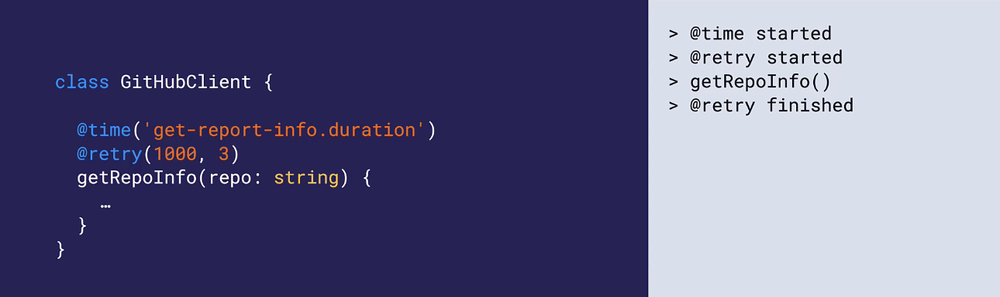

# TypeScript Deep Dive: Creating and Using Decorators Course Notes

## Introduction to Decorators

### Introduction
- Types of Decorators: Classes, Methods, Accessors, Properties, and Auto-accessors
- Used for Metaprogramming
	- A programming tecnique in which computer programs have the ability to treat other programs as their data
	- A program can be desinged to read/generate/analyze/transform other programs, and even modify itself while running

### Prerequisites
- Higher-order Functions: Using functions as parameters
	```typescript
	function process(input: number[], func: (n: number) => number): number[] {
		const result = []
		for(let i = 0; i < input.length; i++) {
			const processed = func(input[i]) // for every element, it calls a function
			result.push(processed) // Adding value to result array
		}
		return result
	}
	```
- Currying: Create a function using another function 
	```typescript
	function add(left: number) { //
		return function (right: number) {
			return left + right
		}
	}

	const add5 = add(5) // add5 is a function
	console.log(add5(20)) // 25
	console.log(add5(30)) // 35

	// Closure: A function has access to its surrounding scope
	```

### Method Decorators
- Logging Decorator
	```typescript
	// Write a log message before and after a target method's execution

	function log(target, context) {
		return function(this, ...args) {
			const result = target.apply(this, args)
		}
	}
	```
- Decorator Definition
	```typescript
	type ClassMethodDecorator = (
		value: Function, // A decorator is defined as a function
		context: {
			kind: 'method' // Others are: class, property, etc.
			name: string | symbol
			static: boolean
			private: boolean
			access: {get: () => unknown } // Access object that contains the getter
			addInitializer(initializer: () => void): void
			metadata: Record<PropertyKey, unknown> // Allows decorator to add additional information about this method that can be used later
		},
	) => Function | void
	```
- Applications of Method Decorators: Logging, Metrics/Tracing, Caching, Transactions, Callbacks
- Method Decorator Limitations
	- Regular Functions
	- Constructors

### Decorator Factories
- Decorator Factory: A function that creates decorators
- Using a Decorator Factory
```typescript
// Decorator factory
// Overall creates decorator who can they apply using the provided parameters. Can create a decorator with different configurations
function log(logLevel: logLevel) { 
	// Decorator function
	return function (target: any, context: any) {
		// Decorated method
		...
		return resultMethod
	}
}

class GitHubClient {
	@log(Logger.INFO)
	get RepoInfo(repo: string) {...}
}

// Example :
function log(target: any, context: any) {
	// Decorator method
	const resultMethod = async function (this, ...args) {
		logger.log(`Running method ${context.name}`, Logger.INFO)
		const rest = target.apply(this, args)
		logger.log(`Finished method ${context.name}`, Logger.INFO)
		return res
	}
	return resultMethod
}

class GitHubClient {
	@log()
	get RepoInfo(repo: string) {}
}
```

### Applying Multiple Decorators
- Multiple decorators are applied from bottom to top


### Defining Typed Decorators
- Before
	```typescript
	function log(
		target: any // Currently untyped
		context: any
	) {
		const resultMethod = async function (this: any, ...args: any) {
			console.log(`@log - ...`)
			...
		}
		return resultMethod
	}
	```

