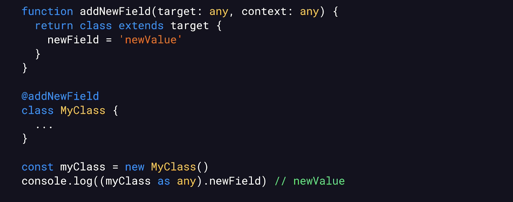
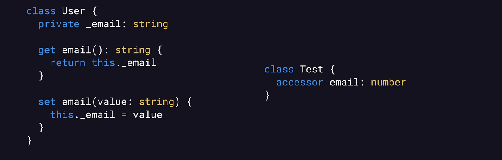
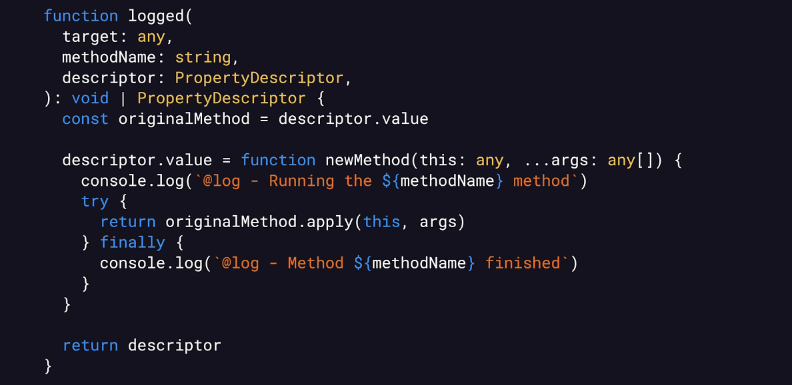
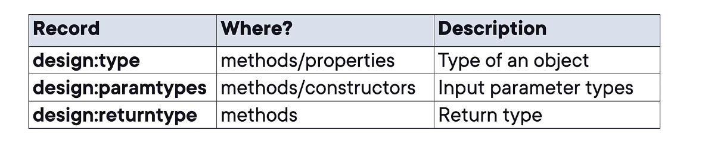

# TypeScript Deep Dive: Creating and Using Decorators Course Notes

## Implementing Advanced Decorators

### Implementation
- Decorator Based Features:
	- Inputs Validation
	- Authentication
	- Caching
	- Database schema definitions
	- Tasks scheduling
- Create an Object Graph

### Class Decorators
- Function
	- Receives a class
	- [Optionally] returns a new class
- What can we do?
	- Record metadata
	- Modify a class
	- Execute code on instance creation

```typescript
// Record Decorator Classes

Set<any> decoratedClasses = new HashSet<>()

// Target: Decorated class
function record (target: any, context: ClassDecoratorContext) {
	decoratedClasses.add(target) // Store class
}

@record // Apply decorator onto class
class MyClass{
	...
}
```
- Adds a callback to be invoked AFTER the class definition has been finalized (not during an instance)
- Add New Field to a Class
	- 

### Using Express.js Framework
- Popular Node.js web framework
- Using Express.js
	```typescript
	import express, {Request, Response} from 'express';

	const app = express();
	app.get('/user/current', (req: Request, res: Response) => {

	});
	```
### Property Decorators
- Property Decorator Example: Initialize Property
	```typescript
	// Will check if initial value assigned to decorated property is not 0
	function notZero (_: any, context: any) {
		// Receive initial value assigned to decorated property when class instance is created. Values returned will be assigned to decorated property
		return function(initialValue:any) {
			if (initialValue === 0) { // Validation
				throw new Error('Initial value cannot be zero')
			}
			return initialValue // To use as is, just return it
		}
	}

	// When instance of class is created, it will have initial value assigned to property and will also be validated
	class MyClass 
	@notZero
	myField: number = initValue()
	```
- Accessors Decorators (for getters/setters)
- Auto-Accessors
	- Syntax for defining a field with accessors
	- Creates getters and setters automatically
	- Useful for decorators
		- Define initial value
		- Can replace an auto-successor
- 
	- Will generate a getter, setter, and private field
	```typescript
	class Test {
		accessor email: number
	}
	```
- Auto-Accessor Decorator Example
```typescript
// Checks if number assigned to a field is not negative
function notNegative(target: any, context: any) {
	return {
		set(this: any, newValue: any) {
			if (newValue < 0) { // Validation
				throw new Error('Value cannot be 0')
			}
			target.set.call(this, newValue) // Set value to auto successor
		},
	}
}

class User {
	@notNegative
	accessor age: number = 0
}
// New value is validated before it is assigned

```

### Decorators Metadata
- Decorator Metadata Example
	```typescript
	type Class = { new(...args: any[]): any}

	const requiredFields = new Map<Class, Set<string>>()

	function required(target: any, context: any) {
		context.addInitializer(function (this:any): void {
			// Update the required fields for this class
			// Will be called every time an object is created
		})
	}
	```
- Metadata is a field in the context parameter that contains key value pairs (Record<PropertyKey>, unknown) that can be set in any of the decorators
	- Allows to add additional data to the class where decorator is being used
- ??= : assign value to specified value if null or undefined
- Records metadata about decorators' targets
- Method's parameter types, return types, etc.
- tsconfig: emitDecoratorMetadata: true

### Experimental Decorators
- Experimental Decorators - Method Decorator
	- 
		- PropertyDescriptor: An object describing a class's property
			```typescript
			interface PropertyDescriptor {
				configurable?: boolean; // determines if property can be changed/deleted
				enumerable?: boolean; // included if iterating over a list of properties in a class where its defined
				value?: any; // Value assigned to the property
				writable?: boolean; // Defines if value of property can be changed
				get?(): any; //
				set?(v: any): void;

			}
			```
- Experimental Decorators - Property Decorator
	```typescript
	function nonEnumerable(
		target: any,
		key: string,
		descriptor: PropertyDescriptor
	) {
		descriptor.enumerable = false // if someone iterates overlist of peroperties, they won't get the property
	}
	```
- Experimental Decorators - Class Decorator
		```typescript
	function classDecorator(target: any) {
		return class extends target {
			newField = 'newValue';
		}
	}
	```
- New vs. Experimental Decorators
	- Different APIs
		- Experimental decorators receive the "target" parameter
		- Different return types
	- Other Differences
		- Reflect metadata
		- Parameter decorators

### Reflect Metadata
- Automatically adding metadata on decorated classes/methods/etc.
	- Reflection - a program can examine its own structure
	- Data about parameter types, return types,
	etc.
- Reflect Metadata API
	- Not exclusive to decorators
- Decorator Metadata
	- 

### Parameter Decorators
- Decorator for individual method parameters: Function called for each decorated parameter
- Support for query parameters in HTTP requests
- Query Parameters: Using parameter decorators
	- Defined after the ? in a url